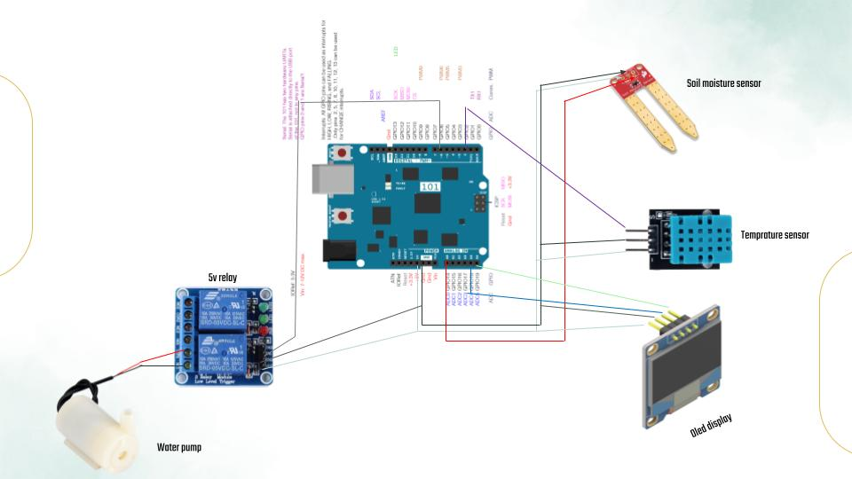

# H20matic

This project is a smart plant watering system built using Arduino Uno. It continuously monitors soil moisture and temperature levels and automatically activates a water pump when the soil is dry. An OLED display shows real-time readings of moisture percentage and temperature.

## Features

- Monitors soil moisture using a capacitive sensor
- Measures ambient temperature using a DHT11 sensor
- Automatically waters the plant when moisture is below 80%
- Displays moisture and temperature data on a 1.3" SH1106 OLED screen
- Relay-controlled pump for efficient water usage

## Components Used

- Arduino Uno R3  
- Capacitive Soil Moisture Sensor (Analog)  
- DHT11 Temperature & Humidity Sensor  
- 1.3" OLED Display (SH1106)  
- Mini DC Submersible Water Pump  
- 5V 2-Channel Relay Module  
- Jumper Wires, Breadboard  
- Wires for water level detection

## Final Product

## Circuit Diagram

> Make sure to connect all components according to the circuit diagram for correct operation. Double-check power and ground connections before uploading code.

## Working Principle

The system reads the soil moisture level through the analog sensor and checks the ambient temperature using the DHT11 sensor. If the moisture level is below 80%, it triggers the relay module to power the water pump for a fixed duration (7 seconds). All data is updated and shown in real time on the OLED display.

## How to Use

1. Connect all components as per the circuit diagram.
2. Upload the Arduino code using the Arduino IDE.
3. Power the Arduino using a USB cable or a suitable power adapter.
4. The system will automatically start monitoring and watering the plant when required.

## License

This project is open-source and available under the MIT License.

