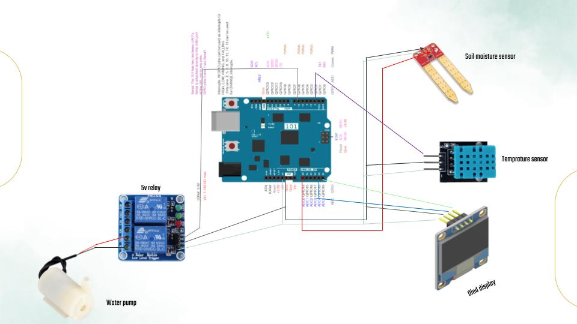

#  H20Matic Plant Watering System

An Arduino-based smart irrigation system that monitors soil moisture in real time and waters your plants automatically — no manual checking, no guesswork.


<p align="center">
  <br>
  <em>Prototype</em>
</p>


## Overview

Indoor plants suffer most from inconsistent watering — not lack of care, but lack of time. This project solves that with a closed-loop system: a capacitive soil moisture sensor continuously reads the soil, and when moisture drops below a set threshold, a relay-controlled mini water pump activates automatically. A DHT11 sensor adds ambient temperature and humidity context, and a 1.3" OLED display shows live readings so you can check plant status at a glance.

Built as a Design Thinking & Innovation project, this system prioritizes simplicity, low cost, and non-blocking real-time operation over unnecessary complexity.

## Features

- 🌡️ **Real-time soil moisture monitoring** via capacitive sensor
- 💧 **Automatic pump control** through a relay module — no manual triggering
- 🌡️ **Temperature & humidity tracking** with a DHT11 sensor
- 📟 **Live OLED display** of moisture %, temperature, and pump status
- 🚱 **Overflow protection** — pump stops when the reservoir is full or moisture is sufficient
- ⚡ **Non-blocking code** using `millis()` instead of `delay()` for smooth, responsive operation

## How It Works

```
Soil Moisture Sensor ─┐
DHT11 Sensor          ├──► Arduino Uno ──► Relay Module ──► Water Pump
Water Level Wires     ─┘         │
                                  └──► OLED Display (live readings)
```

1. The Arduino continuously reads soil moisture, temperature, and water level.
2. If soil moisture falls below the threshold **and** the reservoir isn't empty, the pump turns on.
3. Watering stops once moisture is restored or the water level runs low.
4. All readings are pushed to the OLED display in real time.

## Hardware

| Component | Purpose |
|---|---|
| Arduino Uno R3 | Central microcontroller |
| Capacitive Soil Moisture Sensor | Detects soil dryness (corrosion-resistant) |
| DHT11 Sensor | Ambient temperature & humidity |
| 1.3" OLED Display (SH1106) | Real-time data visualization |
| Mini Water Pump (DC 4–12V) | Delivers water to the plant |
| 5V 2-Channel Relay Module | Switches pump power |
| Water level sensing wires | Prevents overflow / dry-run |

## Software & Libraries

- [Arduino IDE](https://www.arduino.cc/en/software)
- Adafruit GFX Library
- SH1106 OLED Library
- DHT11 Library

## Circuit Diagram



## Getting Started

### 1. Wire the components
Follow the circuit diagram above — soil sensor to an analog pin, relay to a digital pin controlling the pump, DHT11 and OLED on their respective data lines.

### 2. Install dependencies
In Arduino IDE, install via Library Manager:
- `Adafruit GFX Library`
- `SH1106 Library`
- `DHT sensor library`

### 3. Upload the code
Open `plant_watering_system.ino`, select your board (Arduino Uno) and port, then upload.

### 4. Set your threshold
Adjust the moisture threshold constant in the code to match your plant's needs (default: 80%).

## Project Structure

```
automatic-plant-watering-system/
├── README.md
├── LICENSE
├── src/
│   └── plant_watering_system.ino
├── docs/
│   └── Automatic_Plant_Watering_System_Report.pdf
├── assets/
│   ├── prototype.jpg
│   ├── block-diagram.png
│   ├── architecture-diagram.png
│   ├── flow-diagram.png
│   └── circuit-diagram.png
└── .gitignore
```

## Applications

- Home & indoor gardening
- Small-scale urban farming
- Offices and community green spaces
- Educational demos for IoT / embedded systems

## Future Enhancements

- Wi-Fi connectivity (ESP32) for remote monitoring via mobile app
- Light intensity sensing for shade/sun-loving plants
- Weather-API integration to skip watering on rainy days
- Predictive watering using historical soil data

## Author

**Krishaanthan V**
B.E. Computer Science and Engineering, Sathyabama Institute of Science and Technology

## License

This project is open-sourced under the [MIT License](LICENSE).
